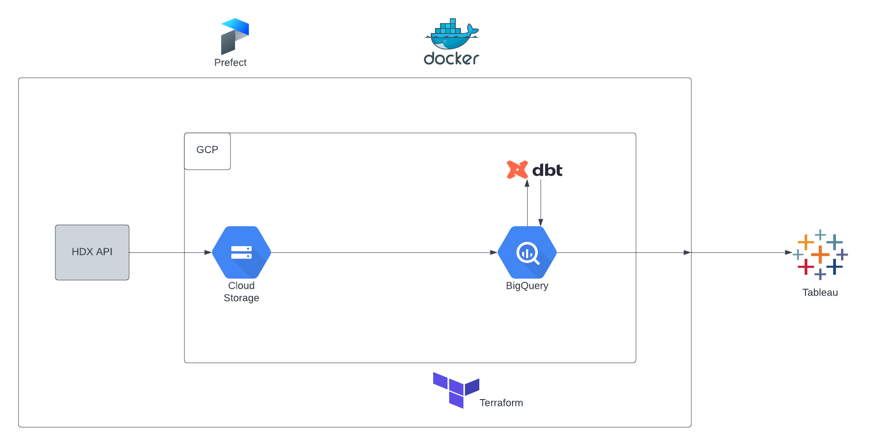

# HDX Data Pipeline - Insights on forcibly displaced populations and stateless persons in Haiti
Data pipeline orchestrated with Prefect, using data from HDX API

### Project Components:
The following tools were used to achieve this project:

- Containerization: Docker
- Data: Humanitarian Data Exchange API ((Link))[https://hdx-python-api.readthedocs.io/en/latest/]
- IaC: Terraform
- Data Lake: Google Cloud Storage
- Data Warehouse: Google BigQuery
- Transformations: DBT
- Orchestration: Prefect
- Data visualisation: Tableu **Work in progress**

### To run code locally:
   - Type in terminal: `pip install -r requirements.txt`
   - Set up a a project in GCP:
     - create a service account with necessary roles/permissions (BigQuery Admin, BigQuery Job User, BigQuery User, Cloud Run Admin, Secret Manager Admin, Servcice Account User, Storage Admin, Storage Object Admin, Viewer)
     - Enable necessary APIs in GCP
     - Create and download service account key
     - Dwonload and install Google SDK
     - Set your credentials environment variable to the location of your JSON key file: `export GOOGLE_APPLICATION_CREDENTIALS="your_key.json"` and/or edit line 15 of `get_haiti_data.py` with location of JSON file.
     - Authenticate using: `gcloud auth application-default login`
   - provide necessary variable values in a `terraform.tfvars` file (create in terraform folder)
     -   project_id = "haiti-insights"
     -   gcp_credentials = "Path to JSON file"
     -   region = "Whichever region you want your project to reside in (potential codes)[https://cloud.google.com/compute/docs/regions-zones]"
     -   bucket_name ="haiti-tracking-data"
     -   storage_class = "STANDARD"
     -   registry_id="haiti-tracking-docker"
   - Create Prefect API key and paste into terminal: `prefect cloud login -k '<my-api-key>'` 
   - configure necessary Prefect blocks (GCP Credentials, GCS Bucket)
   - `cd` into prefect folder and run `python get_haiti_data.py`

**Note: Docker is used to run a Prefect deployment fully in the cloud with Cloud Run, the `GCP Cloud Run Job` Prefect block, and the `GitHub` Prefect block.**

### Pipeline Diagram

### Tableau Visualisation (To be completed):
